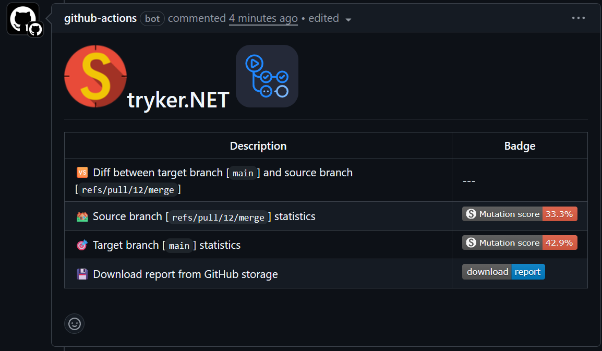

<div align="center">

# [](https://github.com/stryker-mutator/stryker-net)tryker.NET GitHub action <a href="https://github.com/kurnakovv/stryker-net-action"></a>


[](https://github.com/kurnakovv/stryker-net-action/actions/workflows/all-params-test.yml)
[](https://github.com/kurnakovv/stryker-net-action/actions/workflows/disable-all-params-test.yml)
[](https://github.com/kurnakovv/stryker-net-action/actions/workflows/without-params-test.yml)

</div>

This is a GitHub action that runs the [Stryker.NET](https://stryker-mutator.io/docs/stryker-net/introduction/) tool 👽

# 💡 Features
* 🏡 Generate a report for source branch
* 💾 Download the report
* 📊 Upload the report to the dashboard
* 📩 Send a report message when PR is opened
* 🆚 Compare a source and target branches

# 🚀 Quick start

1️⃣ Install `dotnet-stryker` (optional) | [how?](https://stryker-mutator.io/docs/stryker-net/getting-started/#install-in-project)

2️⃣ Add a config file via terminal
```
dotnet stryker init --config-file ".config/stryker-config.json"
```
Or just create an empty file `.config/stryker-config.json`

3️⃣ Open `.config/stryker-config.json` and set minimum parameters
```json
{
    "stryker-config": {
        "reporters": [
            "html",
            "dashboard",
            "progress",
        ],
        "project-info": {
            "name": "github.com/OWNER/YOUR_REPOSITORY_NAME"
        }
    }
}
```

Replace:
* **OWNER** - with your GitHub username (e.g. `kurnakovv`)
* **YOUR_REPOSITORY_NAME** - with your repository name (e.g. `stryker-net-action`)

4️⃣ Add GitHub secret ([how?](https://docs.github.com/en/actions/how-tos/security-for-github-actions/security-guides/using-secrets-in-github-actions)):
* **Name** - `STRYKER_DASHBOARD_API_KEY`
* **Value** - dashboard API key ([how to get?](https://stryker-mutator.io/docs/General/dashboard/))

5️⃣ Add the GitHub Action workflow at `.github/workflows/stryker-net.yml`
```yml
name: Stryker.NET mutation testing

on: [push, pull_request]

jobs:
  stryker_net:
    runs-on: ubuntu-latest
    # permissions.pull-request:write is required to send a report message to a pull request (when send-report-message: "true")
    permissions:
      pull-requests: write
    name: Stryker.NET GitHub action
    steps:
      - name: Checkout code
        uses: actions/checkout@v4

      - name: Setup .NET
        uses: actions/setup-dotnet@v4
        with:
          dotnet-version: 9.0.x

      - name: Stryker.NET
        uses: kurnakovv/stryker-net-action@v1.0.0
        with:
          config-path: ".config/stryker-config.json"
          dashboard-api-key: ${{ secrets.STRYKER_DASHBOARD_API_KEY }}
```

6️⃣ Push all changes and open a PR on the default branch ([what is it?](https://stackoverflow.com/questions/71535128/what-exactly-is-the-default-git-branch)).

Once the pipeline completes successfully, you'll see something like this:


> [!NOTE]
> If some steps do not suit you (e.g. you don't want to use the [dashboard](https://stryker-mutator.io/docs/General/dashboard/) or send PR report message), you can disable/remove those options

# ⚙️ Configuration options

| Input | Location | Description | Required | Default |
| ----- | -------- | ----------- | -------- | ------- |
| config-path | with | File path where configuration is located, for example `.config/stryker-config.json` / [docs](https://stryker-mutator.io/docs/stryker-net/configuration) | false | --- |
| dashboard-api-key | with | Stryker dashboard API key / [docs](https://stryker-mutator.io/docs/General/dashboard) | false | --- |
| report-source-branch | with | Run stryker report in current source branch (for default branch this parameter is always true) | false | true |
| report-source-branch-diff | with | Run Stryker report and compare default branch with current source branch. I do not recommend using it, as it works with bugs, this feature is waiting for a fix in this [issue](https://github.com/stryker-mutator/stryker-net/issues/3234) | false | false |
| upload-report | with | Upload report to GitHub cloud / [what's under the hood?](https://github.com/marketplace/actions/upload-a-build-artifact) | false | true |
| send-report-message | with | Send report message when PR is opened (add `permissions.pull-requests: write` to action / [how?](https://docs.github.com/en/actions/writing-workflows/choosing-what-your-workflow-does/controlling-permissions-for-github_token)) / [what's under the hood?](https://github.com/marketplace/actions/add-pr-comment) | false | --- |

> [!NOTE]
> if you are missing some configurations, you can add them to your configuration file `.config/stryker-config.json` | [docs](https://stryker-mutator.io/docs/stryker-net/configuration/)

# ❔ Why
* The official [docs](https://stryker-mutator.io/docs/stryker-net/stryker-in-pipeline/) uses the Azure DevOps syntax, not GitHub Action
* The official [repository](https://github.com/stryker-mutator/github-action) doesn't work properly and has limited functionality. As the author stated [source](https://github.com/stryker-mutator/github-action/issues/23#issuecomment-2553581342):
  > This project is a proof of concept created during a hackfest, there is no active maintainer for this project at this time
* The unofficial [repository](https://github.com/Pub-Dev/stryker-net-action) contains no code and hasn't been updated in over 3 years
* You can also use the source code, but it is too large to duplicate it in each repository, which violates the DRY principle

That's **why** I decided to create this action 🔥

# 🤝 Contributing
If you'd like to contribute and help improve this project — your support is very welcome ❤️

Instructions for all members are [here](CONTRIBUTING.md)

# ⭐ Give a star
If you like this project, please give it a ⭐ — thanks! 🤗
